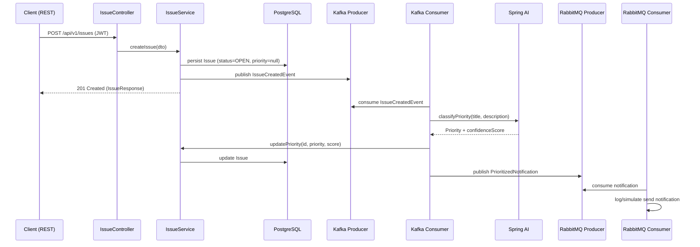

# 02 — Arquitetura

## 1. Visão Geral

O projeto adota uma **arquitetura hexagonal simplificada (ports & adapters)** com organização modular por funcionalidade. Cada módulo (issue, comment, notification, user) possui as suas próprias camadas de domínio, aplicação, infraestrutura e apresentação.

```mermaid
graph TB
    subgraph "Camada de Apresentação"
        RC[REST Controllers]
        SS[Spring Security / JWT]
    end
    subgraph "Camada de Aplicação"
        UC[Use Cases / Services]
        DTO[DTOs / Mappers]
    end
    subgraph "Camada de Domínio"
        ENT[Entities / Value Objects]
        REP[Repository Interfaces]
        EVT[Domain Events]
    end
    subgraph "Camada de Infraestrutura"
        JPA[JPA / Hibernate]
        KP[Kafka Producer]
        KC[Kafka Consumer]
        RP[RabbitMQ Producer]
        RC2[RabbitMQ Consumer]
        AI[Spring AI Classifier]
    end
    subgraph "Observabilidade"
        ACT[Actuator]
        PRO[Prometheus]
        GRA[Grafana]
    end

    RC --> SS
    SS --> UC
    UC --> DTO
    UC --> REP
    UC --> EVT
    REP --> JPA
    EVT --> KP
    KC --> AI
    AI --> UC
    KP --> KC
    KC --> RP
    RC2 --> NOT[Notification Service]
    ACT -.-> PRO
    PRO -.-> GRA
```



## 2. Justificação: Kafka + RabbitMQ

A coexistência de dois brokers de mensagens é uma decisão arquitetural deliberada, sustentada pela diferença de finalidade:

| Aspeto | Kafka | RabbitMQ |
|--------|-------|----------|
| **Função** | Event log imutável do sistema | Notificações assíncronas pontuais |
| **Tipo de dado** | Eventos de domínio (IssueCreated, IssueUpdated, CommentAdded) | Mensagens de notificação (notify.assignee, notify.reporter) |
| **Retenção** | Persistente (configurável por tópico) | Transitória (após consumo confirmado) |
| **Reprocessamento** | Suportado nativamente (offset reset) | Não é o foco (requer re-publicação) |
| **Latência esperada** | Milissegundos a segundos | Milissegundos |
| **Padrão** | Producer-Consumer com offset tracking | Work queue / Pub-Sub |

**Regra prática:** se o evento precisa de ser replayable e auditável, vai para Kafka. Se é uma notificação única que precisa de entrega garantida mas sem retenção histórica, vai para RabbitMQ.

## 3. Fluxo End-to-End (Criação de Issue com IA)



## 4. Diagrama de Camadas (Detalhado)

```
┌─────────────────────────────────────────────────────────┐
│                    Apresentação                           │
│    IssueController, CommentController, AuthController    │
│    DTOs (request/response) + Security Filter (JWT)       │
└──────────────────────┬──────────────────────────────────┘
                       │
┌──────────────────────▼──────────────────────────────────┐
│                    Aplicação                              │
│    CreateIssueUseCase, CommentService, AuthService       │
│    Mappers (MapStruct), Validadores                      │
└──────┬──────────────────┬──────────────────┬─────────────┘
       │                  │                  │
┌──────▼──────┐   ┌───────▼───────┐  ┌───────▼────────┐
│  Spring AI   │   │ Kafka Producer│  │ RabbitMQ        │
│ (Priorização)│   │ (Event Stream)│  │ (Notificações)  │
└──────────────┘   └───────┬───────┘  └───────┬─────────┘
                           │                  │
                  ┌────────▼────────┐ ┌───────▼─────────┐
                  │ Kafka Consumer   │ │ RabbitMQ Consumer│
                  │ (Virtual Threads)│ │(Virtual Threads) │
                  └────────┬─────────┘ └──────────────────┘
                           │
┌──────────────────────────▼──────────────────────────────┐
│                    Persistência                           │
│    IssueJpaRepository (JPA/Hibernate + PostgreSQL)        │
└──────────────────────────────────────────────────────────┘

┌──────────────────────────────────────────────────────────┐
│            Observabilidade transversal                    │
│    Actuator → Micrometer → Prometheus → Grafana          │
└──────────────────────────────────────────────────────────┘
```

## 5. Versão Atual vs. Versão Alvo

| Dimensão | Versão Atual (estrutura) | Versão Alvo (implementada) |
|----------|-------------------------|---------------------------|
| Organização | Módulos separados por funcionalidade (issue, comment, etc.) | Mesma estrutura, com lógica de negócio implementada |
| Domínio | Interfaces e classes esqueleto criadas | Regras de negócio, validações e eventos de domínio operacionais |
| Persistência | Pasta de migração com V1__create_issue_table.sql | Schema completo (users, issues, comments, notifications) |
| API | DTOs definidos | Endpoints REST operacionais com versionamento /api/v1 |
| Segurança | Config classes criadas | JWT emitido e validado, autorização por role |
| Mensageria | KafkaConfig e RabbitMqConfig criados | Producers/consumers operacionais com Virtual Threads |
| IA | SpringAiClassifier esqueleto | Classificação funcional com fallback |
| Observabilidade | ObservabilityConfig criado | Métricas expostas e dashboard Grafana |
| Testes | Apenas pasta src/test/java | Testes unitários, de integração (Testcontainers) e de carga |
| Containerização | docker-compose.yml e Dockerfile vazios | Sistema completo sobe com `docker compose up` |
