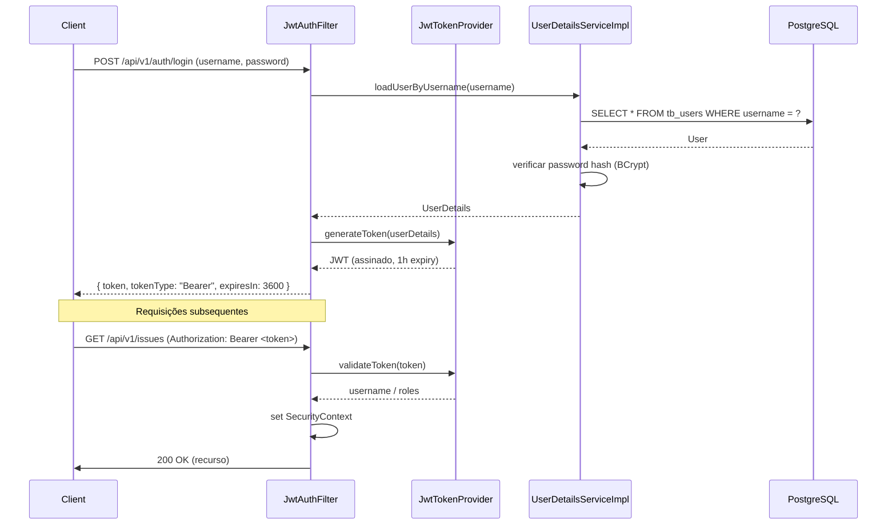

# 07 — Segurança

## 1. Fluxo JWT



## 2. Componentes de Segurança

| Componente | Responsabilidade |
|------------|-----------------|
| `SecurityConfig.java` | Configuração da cadeia de filtros HTTP, CORS, CSRF (desativado para API REST) |
| `JwtAuthFilter.java` | Filtro OncePerRequest que extrai e valida o token JWT, populando o SecurityContext |
| `JwtService.java` | Geração e validação de tokens (assinatura HMAC-SHA256) |
| `UserDetailsServiceImpl.java` | Carrega utilizador da base de dados e converte para UserDetails do Spring |

## 3. Estrutura do Token JWT

```json
{
  "sub": "joao",
  "roles": ["ADMIN"],
  "iat": 1705310000,
  "exp": 1705313600
}
```

- **Algoritmo**: HMAC-SHA256 (jjwt)
- **Expiração**: 1 hora (configurável via `application.yml`)
- **Claims**: subject (username), roles, issued-at, expiration

## 4. Password Hashing

- Algoritmo: BCrypt (Spring Security `PasswordEncoder`)
- Força: 10 rounds (configurável)
- O hash é gerado no registo e verificado no login

## 5. Autorização por Role

| Endpoint | ADMIN | DEVELOPER | VIEWER |
|----------|-------|-----------|--------|
| GET /api/v1/issues | ✅ | ✅ | ✅ |
| POST /api/v1/issues | ✅ | ✅ | ❌ |
| PATCH /api/v1/issues/{id}/status | ✅ | ✅ | ❌ |
| PATCH /api/v1/issues/{id}/priority | ✅ | ❌ | ❌ |
| POST /api/v1/issues/{id}/comments | ✅ | ✅ | ❌ |
| GET /api/v1/issues/{id}/comments | ✅ | ✅ | ✅ |

## 6. CORS

Configurado em `SecurityConfig.java` para permitir origens definidas por variável de ambiente (`CORS_ALLOWED_ORIGINS`). Em desenvolvimento, `http://localhost:3000` (ou outro porto do frontend, quando existir).

```yaml
cors:
  allowed-origins: ${CORS_ALLOWED_ORIGINS:http://localhost:3000}
```

## 7. Rate Limiting

*(A implementar em fase 2)*

Estratégia prevista: token bucket por IP ou por utilizador autenticado, usando `Bucket4j` ou filtro Spring personalizado.

## 8. Checklist OWASP Básica

- [x] Passwords armazenadas com BCrypt (nunca em plain text)
- [x] Token JWT assinado e validado em cada requisição
- [x] CSRF desativado apenas porque é API REST com JWT (stateless)
- [x] CORS configurado com whitelist de origens
- [ ] Rate limiting (pendente)
- [ ] Content Security Policy headers (pendente)
- [ ] Validação de input com Bean Validation (@NotBlank, @Size, etc.)
- [ ] Segredo JWT externo (via variável de ambiente `JWT_SECRET`), nunca no código-fonte
