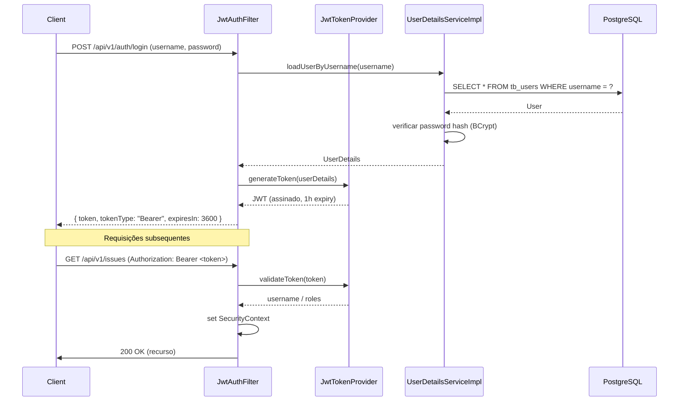

# 07 — Segurança

## 1. Fluxo JWT



## 2. Componentes de Segurança

| Componente | Responsabilidade |
|------------|-----------------|
| `SecurityConfig.java` | Configuração da cadeia de filtros HTTP, CORS, CSRF (desativado para API REST) |
| `JwtAuthFilter.java` | Filtro OncePerRequest que extrai e valida o token JWT, populando o SecurityContext |
| `JwtService.java` | Geração e validação de tokens (assinatura HMAC-SHA256) |
| `UserDetailsServiceImpl.java` | Carrega utilizador da base de dados e converte para UserDetails do Spring |

## 3. Estrutura do Token JWT

```json
{
  "sub": "joao",
  "roles": ["ADMIN"],
  "iat": 1705310000,
  "exp": 1705313600
}
```

- **Algoritmo**: HMAC-SHA256 (jjwt)
- **Expiração**: 1 hora (configurável via `application.yml`)
- **Claims**: subject (username), roles, issued-at, expiration

## 4. Password Hashing

- Algoritmo: BCrypt (Spring Security `PasswordEncoder`)
- Força: 10 rounds (configurável)
- O hash é gerado no registo e verificado no login

## 5. Autorização por Role

| Endpoint | ADMIN | DEVELOPER | VIEWER | Origem |
|---|---|---|---|---|
| `GET /api/v1/issues`, `GET /{id}` | ✅ | ✅ | ✅ | RN-07 |
| `POST /api/v1/issues` | ✅ | ✅ | ❌ | `07-security.md` |
| `PATCH /{id}/status` | ✅ | ✅ | ❌ | RN-01 |
| `PATCH /{id}/priority` | ✅ | ❌ | ❌ | RN-02 |
| `PATCH /{id}/assignee` | ✅ | ✅ | ❌ | RF-16 |
| `PATCH /{id}/details` | ✅ | ✅ | ❌ | RF-19 |
| `DELETE /{id}` | ✅ | ❌ | ❌ | `06-api-contract.md`, 3.7 |
| `POST /{issueId}/comments` | ✅ | ✅ | ❌ | `07-security.md` |
| `GET /{issueId}/comments` | ✅ | ✅ | ✅ | `07-security.md` |
| `GET /api/v1/notifications` | ✅ | ✅ | ✅ | qualquer utilizador autenticado, apenas as suas próprias |
| `POST /api/v1/users` | ✅ | ❌ | ❌ | RN-08 |

## 6. CORS

Configurado em `SecurityConfig.java` para permitir origens definidas por variável de ambiente (`CORS_ALLOWED_ORIGINS`). Em desenvolvimento, `http://localhost:3000` (ou outro porto do frontend, quando existir).

```yaml
cors:
  allowed-origins: ${CORS_ALLOWED_ORIGINS:http://localhost:3000}
```

## 7. Rate Limiting

*(A implementar em fase 2)*

Estratégia prevista: token bucket por IP ou por utilizador autenticado, usando `Bucket4j` ou filtro Spring personalizado.

## 8. Logout / Revogação de Tokens

O sistema adota uma abordagem **stateless** para sessões: não existe estado de sessão no servidor, e o token JWT é autossuficiente. Consequentemente, não há endpoint de logout servidor nem blacklist de tokens revogados.

- O cliente é responsável por descartar o token localmente (removendo-o do *localStorage* / *sessionStorage* ou do estado da aplicação) quando o utilizador termina a sessão.
- O token mantém-se tecnicamente válido até expirar (1h), mas sem o token o cliente não consegue fazer requisições autenticadas.
- Esta decisão baseia-se na curta janela de expiração (1h), na simplicidade operacional e na ausência de requisitos de revogação imediata no MVP.

Para um mecanismo de revogação servidor (Fase 2), ver `docs/01-requirements.md` secção 6.

## 9. Checklist OWASP Básica

- [x] Passwords armazenadas com BCrypt (nunca em plain text)
- [x] Token JWT assinado e validado em cada requisição
- [x] CSRF desativado apenas porque é API REST com JWT (stateless)
- [x] CORS configurado com whitelist de origens
- [ ] Rate limiting (pendente)
- [ ] Content Security Policy headers (pendente)
- [x] Validação de input com Bean Validation (@NotBlank, @Size, etc.) — ver RNF-07 em `docs/01-requirements.md` secção 4
- [x] Segredo JWT externo (via variável de ambiente `JWT_SECRET`), nunca no código-fonte
