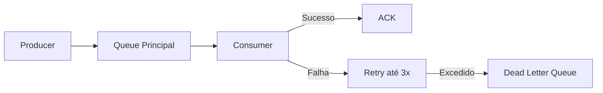

# 08 — Mensageria

## 1. Kafka — Event Stream

### 1.1. Tópicos

| Tópico | Partições | Retenção | Finalidade |
|--------|-----------|----------|------------|
| `issue-events` | 3 | 7 dias | Eventos de domínio de issues (criação, atualização, mudança de estado) |
| `comment-events` | 2 | 7 dias | Eventos de comentários |

### 1.2. Estrutura dos Eventos

```json
{
  "eventId": "uuid",
  "eventType": "ISSUE_CREATED",
  "timestamp": "2025-01-15T10:30:00Z",
  "payload": {
    "issueId": "uuid",
    "title": "...",
    "description": "...",
    "reporterId": "uuid"
  }
}
```

### 1.3. Producers

| Producer | Eventos publicados |
|----------|-------------------|
| `IssueEventPublisher` | IssueCreatedEvent, IssueUpdatedEvent, IssuePrioritizedEvent |
| `CommentEventPublisher` | CommentAddedEvent |

### 1.4. Consumers

| Consumer | Tópico | Grupo | Processamento |
|----------|--------|-------|---------------|
| `IssueEventConsumer` | `issue-events` | `issue-classification-group` | Invoca Spring AI e atualiza prioridade |

### 1.5. Virtual Threads

Os consumidores Kafka executam em Virtual Threads:

```java
@Bean
public ConcurrentKafkaListenerContainerFactory<String, IssueEvent> factory() {
    var factory = new ConcurrentKafkaListenerContainerFactory<String, IssueEvent>();
    factory.setConsumerFactory(consumerFactory());
    factory.getContainerProperties().setConsumerTaskExecutor(
        Executors.newVirtualThreadPerTaskExecutor()
    );
    return factory;
}
```

## 2. RabbitMQ — Notificações

### 2.1. Filas e Trocas

| Nome | Tipo | Finalidade |
|------|------|------------|
| `notifications.exchange` | Topic | Exchange principal de notificações |
| `notifications.issue.assigned` | Queue (binding key: `issue.assigned.#`) | Notificação de issue atribuída |
| `notifications.comment.added` | Queue (binding key: `comment.added.#`) | Notificação de novo comentário |
| `notifications.priority.set` | Queue (binding key: `priority.set.#`) | Notificação de prioridade definida |
| `notifications.dlq` | Queue | Dead Letter Queue (após 3 retries falhadas) |

### 2.2. Producers

| Producer | Filas alvo | Mensagem |
|----------|-----------|----------|
| `NotificationProducer` | `notifications.issue.assigned`, `notifications.comment.added`, `notifications.priority.set` | { recipientId, message, type } |

### 2.3. Consumers

| Consumer | Fila | Ação |
|----------|------|------|
| `NotificationConsumer` | Todas as filas acima | Persiste notificação e simula envio (log) |

## 3. Estratégia de Retry e DLQ



| Parâmetro | Kafka | RabbitMQ |
|-----------|-------|----------|
| Número de retries | Configurado no `@RetryableTopic` (default: 3) | `x-delivery-count` + DLQ binding |
| Intervalo entre retries | Exponential backoff (1s, 2s, 4s) | Fixed (5s) |
| Ação após esgotar | Log + skip (evento permanece no tópico) | Move para DLQ + alerta |
| Monitorização | Métrica `spring.kafka.listener.*` | Métrica `spring.rabbitmq.listener.*` |

## 4. Idempotência

Para garantir que o consumo repetido de uma mensagem não produz efeitos colaterais duplicados:

- **Kafka**: `idempotence=true` no producer + `enable.idempotence=true` no consumer.
- **RabbitMQ**: verificação de duplicados por `messageId` antes de processar (tabela `processed_messages` ou cache).
- **Casos de uso**: criar notificação apenas se ainda não existir notificação com o mesmo `eventId` + `recipientId`.
