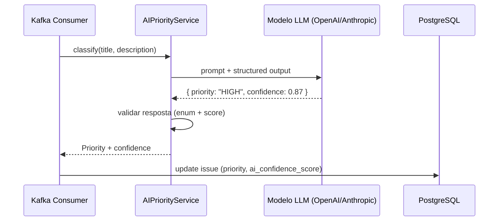

# 09 — Classificação por IA

## 1. Integração Spring AI

O projeto usa **Spring AI** para invocar um modelo de linguagem (LLM) que classifica a prioridade de uma issue com base no título e descrição.

## 2. Fluxo de Classificação



## 3. Prompt Template

```text
You are an issue triage assistant. Given the title and description of
a software issue, classify its priority as one of: LOW, MEDIUM, HIGH,
CRITICAL.

Respond with a JSON object:
{ "priority": "HIGH", "confidence": 0.85 }

Rules:
- CRITICAL: security vulnerabilities, data loss, production outage.
- HIGH: major feature broken, no workaround.
- MEDIUM: non-critical bug, has workaround.
- LOW: cosmetic, minor improvement, documentation.

Title: {title}
Description: {description}
```

## 4. Structured Output (Spring AI)

```java
public record PriorityClassification(
    @JsonProperty("priority") IssuePriority priority,
    @JsonProperty("confidence") double confidence
) {}
```

O Spring AI permite mapear a resposta do LLM diretamente para este record, eliminando parsing manual.

## 5. Estratégia de Fallback

| Cenário | Ação | Prioridade resultante |
|---------|------|----------------------|
| LLM retorna resposta inválida | Re-tentar 1x; se falhar, usar fallback | MEDIUM |
| Timeout na chamada (5s) | Capturar exceção, logar, usar fallback | MEDIUM |
| Rate limit excedido | Esperar e retentar com backoff | (temporário) |
| All attempts falham | Fallback final | MEDIUM |

```java
try {
    return aiService.classify(title, description);
} catch (AiException e) {
    log.warn("IA classification failed, using fallback: {}", e.getMessage());
    return new PriorityClassification(MEDIUM, 0.0);
}
```

## 6. Metodologia de Avaliação de Precisão

Para validar a métrica de "85% de precisão", segue-se esta metodologia:

### 6.1. Dataset de Teste

Construir um conjunto rotulado manualmente com ~100-200 issues representativas:

- 25% LOW, 25% MEDIUM, 30% HIGH, 20% CRITICAL (distribuição realista)
- Issues com linguagem variada (técnica, reporte de bug, pedido de funcionalidade)

### 6.2. Métricas

| Métrica | Cálculo | Alvo |
|---------|---------|------|
| Accuracy | (TP + TN) / total | ≥ 85% |
| Precision por classe | TP / (TP + FP) | ≥ 80% cada |
| Recall por classe | TP / (TP + FN) | ≥ 80% cada |
| F1-Score | 2 * (precision * recall) / (precision + recall) | ≥ 80% |

### 6.3. Reprodutibilidade

O dataset e o script de avaliação devem ser versionados no repositório (pasta `src/test/resources/ai-evaluation/`), permitindo execução reproduzível via `mvn test -P ai-evaluation`.

## 7. Circuit Breaker (Fase 2)

Para ambiente produtivo, recomenda-se envolver a chamada ao LLM com um circuit breaker (Resilience4j) para evitar cascata de falhas quando o provedor de IA estiver degradado.
