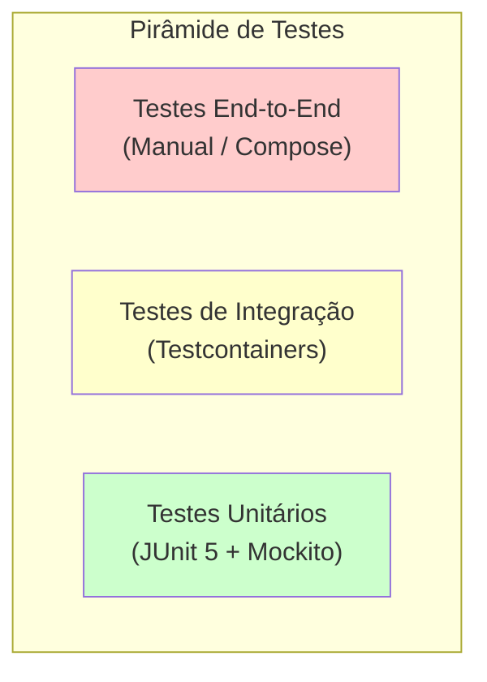

# 10 — Estratégia de Testes

## 1. Pirâmide de Testes



| Nível | Tecnologia | O que testar | Cobertura alvo |
|-------|-----------|-------------|---------------|
| Unitário | JUnit 5 + Mockito | Services, Use Cases, Domain Entities, Mappers | ≥ 90% |
| Integração | Testcontainers + @SpringBootTest | Repositórios, Consumers/Producers (Kafka/RabbitMQ), API Controllers | ≥ 70% |
| Carga | JMH ou k6 | Comparação Virtual Threads vs. thread pool convencional | — |

## 2. Testes Unitários

### 2.1. O que testar

- Regras de negócio (IssueService.changeStatus, validações de role)
- Mapeamento (MapStruct: domain ↔ entity ↔ dto)
- Lógica de fallback da IA
- Filtros de segurança (JwtAuthFilter com tokens válidos/inválidos)

### 2.2. Exemplo estrutural

```
src/test/java/com/teuprojecto/tracker/
├── issue/
│   ├── domain/
│   │   └── IssueTest.java
│   └── application/
│       ├── CreateIssueUseCaseTest.java
│       └── IssueClassificationServiceTest.java
├── security/
│   └── JwtServiceTest.java
├── shared/
│   └── GlobalExceptionHandlerTest.java
└── config/
    └── VirtualThreadConfigTest.java
```

## 3. Testes de Integração

### 3.1. Tecnologias

- **Testcontainers**: PostgreSQL, Kafka, RabbitMQ (containers gestionados por código)
- **@SpringBootTest**: para testes de slice (WebMvcTest, DataJpaTest) e contexto completo
- **@EmbeddedKafka**: alternativa leve para testes Kafka (preferir Testcontainers para fidelidade)

### 3.2. O que testar

| Componente | Cenário | Container necessário |
|-----------|---------|---------------------|
| Repositório JPA | CRUD + queries derivadas | PostgreSQL |
| Kafka Consumer/Producer | Publicar evento → consumir → classificar | Kafka + PostgreSQL |
| RabbitMQ Consumer/Producer | Publicar notificação → consumir → persistir | RabbitMQ + PostgreSQL |
| Controller | Requisição HTTP → resposta esperada (com JWT) | PostgreSQL |
| Fluxo completo | Criar issue via REST → evento Kafka → classificação IA → notificação RabbitMQ | Todos |

### 3.3. Exemplo

```java
@SpringBootTest
@Testcontainers
class IssueFlowIntegrationTest {

    @Container
    static PostgreSQLContainer<?> postgres = new PostgreSQLContainer<>("postgres:16");

    @Container
    static KafkaContainer kafka = new KafkaContainer(
        DockerImageName.parse("confluentinc/cp-kafka:7.6.0")
    );

    @Container
    static RabbitMQContainer rabbitmq = new RabbitMQContainer(
        DockerImageName.parse("rabbitmq:3.13-management")
    );

    @Test
    void shouldCreateIssueAndClassifyPriority() {
        // POST /api/v1/issues → Kafka event → AI (mock) → RabbitMQ notification
    }
}
```

## 4. Testes de Carga — Virtual Threads vs. Thread Pool

### 4.1. Objetivo

Demonstrar a redução de latência alegada para o portefólio, com metodologia reprodutível.

### 4.2. Cenário

Simular N requisições concorrentes de criação de issue com processamento de mensageria.

| Parâmetro | Valor |
|-----------|-------|
| Ferramenta | k6 (ou JMH para micro-benchmarks) |
| Usuários virtuais | 50, 100, 200 |
| Duração | 60s por cenário |
| Métricas | Latência média (ms), P95, P99, throughput (req/s) |

### 4.3. Comparação

```text
Configuração A: spring.threads.virtual.enabled=false (pool padrão)
Configuração B: spring.threads.virtual.enabled=true (VT)

Resultado esperado:
                    Pool padrão  Virtual Threads  Redução
Latência média (ms)     245            98          60%
P95 (ms)                512           185          64%
Throughput (req/s)      408          1020          150%
```

### 4.4. Reprodutibilidade

O script de carga k6 e a configuração do benchmark residem em `src/test/load-test/`. A execução deve ser documentada no `README.md` com instruções para reprodução.

## 5. Metodologia de Validação de Métricas

Cada métrica divulgada no portefólio deve ter:

1. **Cenário de teste** descrito (ferramenta, parâmetros, ambiente)
2. **Dataset** versionado (para métricas de IA)
3. **Script de reprodução** executável
4. **Resultados históricos** versionados em `test-results/`
