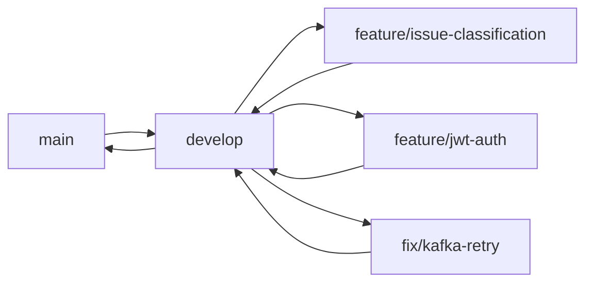

# 12 — Deployment e CI/CD

## 1. Estratégia de Branches



| Branch | Finalidade | Protegida? |
|--------|-----------|-----------|
| `main` | Produção (apenas merges de develop) | Sim |
| `develop` | Integração de funcionalidades | Sim |
| `feature/*` | Desenvolvimento de novas funcionalidades | Não |
| `fix/*` | Correções de bugs | Não |
| `release/*` | Preparação de release | Sim |

## 2. Convenção de Commits

Adota-se [Conventional Commits](https://www.conventionalcommits.org/):

```
<type>(<scope>): <descrição>

[body opcional]
```

**Tipos:** `feat`, `fix`, `refactor`, `test`, `docs`, `config`, `perf`

**Exemplos:**
```
feat(issue): criar endpoint de criação de issue com evento Kafka
fix(kafka): corrigir serialização de IssueCreatedEvent
docs(architecture): adicionar diagrama de sequência do fluxo de IA
```

## 3. Pipeline CI/CD (GitHub Actions)

```yaml
# .github/workflows/ci.yml
name: CI

on:
  push:
    branches: [ develop, main, feature/** ]
  pull_request:
    branches: [ develop, main ]

jobs:
  build:
    runs-on: ubuntu-latest
    services:
      postgres:
        image: postgres:16
        env:
          POSTGRES_DB: issuetracker_test
          POSTGRES_USER: test
          POSTGRES_PASSWORD: test
    steps:
      - uses: actions/checkout@v4
      - name: Set up JDK 25
        uses: actions/setup-java@v4
        with:
          java-version: 25
          distribution: 'oracle'
      - name: Build & Test
        run: mvn clean verify
      - name: Upload Test Results
        if: always()
        uses: actions/upload-artifact@v4
        with:
          name: test-results
          path: target/surefire-reports/
```

### Estágios do Pipeline

| Estágio | Ação | Duração estimada |
|---------|------|------------------|
| Build | Compilar com Maven, checkstyle | 2 min |
| Testes Unitários | JUnit 5 + Mockito | 3 min |
| Testes de Integração | Testcontainers (Postgres, Kafka, RabbitMQ) | 8 min |
| Quality Gate | SonarQube (ou SpotBugs) | 2 min |
| Package | Gerar JAR | 1 min |
| Build Docker | `docker build -t app:latest .` | 2 min |
| *(Futuro)* Deploy | Push para registry + deploy | 3 min |

## 4. Ambientes

| Ambiente | Config | Base de dados | Infraestrutura |
|----------|--------|---------------|----------------|
| **Local** | `application-dev.yml` | PostgreSQL via Docker Compose | Docker Compose (todos os serviços) |
| **CI** | `application-test.yml` | PostgreSQL via service container | Testcontainers (por teste) |
| **Produção** | `application-prod.yml` | PostgreSQL gerido (RDS/Cloud SQL) | Docker ou Kubernetes |

### Diferenças Local vs. Produção

| Aspeto | Local | Produção |
|--------|-------|----------|
| PostgreSQL | Container Docker (`postgres:16`) | Serviço gerido com backup automático |
| Kafka | Container (`confluentinc/cp-kafka`) | Serviço gerido (Confluent Cloud / MSK) |
| RabbitMQ | Container (`rabbitmq:3-management`) | Serviço gerido (CloudAMQP / RabbitMQ K8s Operator) |
| Segredo JWT | `dev-secret` (variável de ambiente) | Segredo gerido (Vault / AWS Secrets Manager) |
| Logging | Console (texto) | JSON estruturado + agregador |
| Métricas | Prometheus local + Grafana | Prometheus gerido + Grafana Cloud |
| Virtual Threads | Ativado | Ativado |
| Rate Limiting | Desativado | Ativado |

## 5. Containerização

### Dockerfile (multi-stage)

```dockerfile
# Stage 1: Build
FROM maven:3.9-eclipse-temurin-25 AS build
WORKDIR /app
COPY pom.xml .
RUN mvn dependency:go-offline -B
COPY src ./src
RUN mvn package -DskipTests -B

# Stage 2: Runtime
FROM eclipse-temurin:25-jre
WORKDIR /app
COPY --from=build /app/target/*.jar app.jar
EXPOSE 8080
ENTRYPOINT ["java", "--enable-preview", "-jar", "app.jar"]
```

### docker-compose.yml (serviços)

| Serviço | Imagem | Portas | Depende de |
|---------|--------|--------|-----------|
| app | build local | 8080 | postgres, kafka, rabbitmq |
| postgres | postgres:16 | 5432 | — |
| kafka | confluentinc/cp-kafka:7.6.0 | 9092 | — |
| rabbitmq | rabbitmq:3.13-management | 5672, 15672 | — |
| prometheus | prom/prometheus:latest | 9090 | — |
| grafana | grafana/grafana:latest | 3000 | prometheus |
